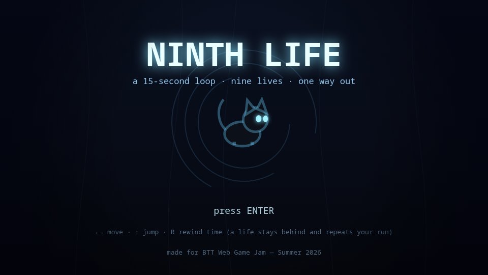
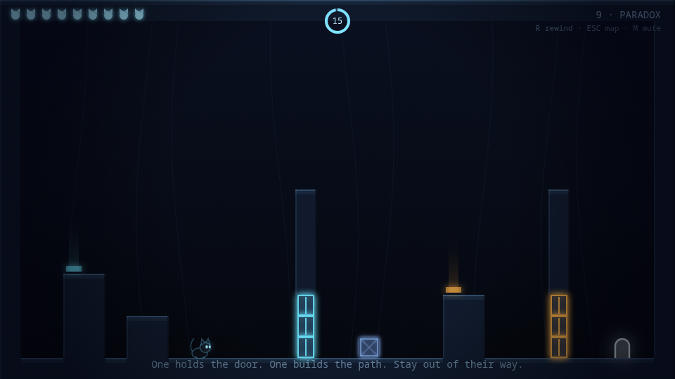
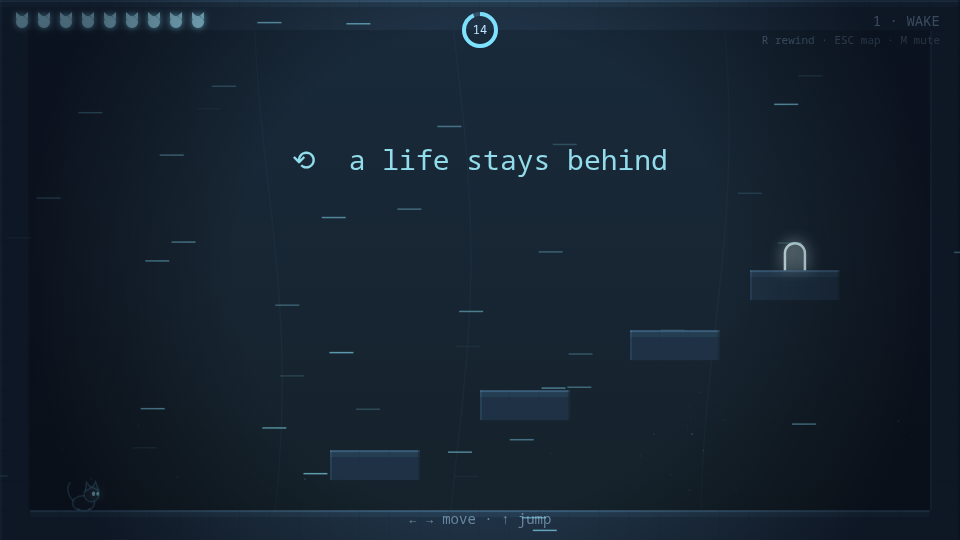
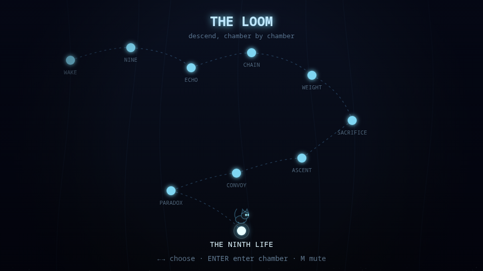

# NINTH LIFE

*A 15-second loop. Nine lives. One way out.*

**▶ Play it: https://opx0.github.io/ninth-life/**

Made in ~24 hours for **BTT Web Game Jam — Summer 2026**.

## The idea

You are a cat trapped in the Loom — a machine that broke time. Every chamber
runs on a **15-second loop**. When you press **R** (or time runs out, or you
die), the world rewinds — but **a life stays behind**: a ghost of you that
replays your last run, input for input.

Your past lives hold pressure plates, shove crates, and stand in pits so the
current you can walk through doors they keep open. You have nine lives per
chamber. Spend them wisely.

At the heart of the Loom, the game asks you one question — and it has **two
endings**.

## Controls

| Key | Action |
|-----|--------|
| ← → / A D | move |
| ↑ / W / Space | jump |
| **R** | rewind the loop (spends a life, leaves an echo) |
| Esc | back to the map |
| M | mute |

Desktop keyboard only — no touch controls.

## How it works (for the technically curious)

**Zero dependencies. No engine. No build step. No asset files.** Everything is
hand-rolled vanilla JavaScript + Canvas 2D + WebAudio:

- **Deterministic fixed-timestep simulation** (60 Hz accumulator loop). Input
  is recorded per tick as a bitmask; a ghost is just that byte array replayed
  through the exact same physics. This is what makes echoes perfectly
  faithful — same tick order (boxes → ghosts oldest-first → player →
  plates/doors), same floating-point math, every loop.
- **The rewind effect is real**: every tick snapshots actor + world state, and
  the rewind animation plays your actual history backwards.
- **All audio is synthesized** — jumps, plates, the tape-rewind sweep, the
  ambient drone-and-arpeggio score, even the meow: oscillators and filtered
  noise, not a single audio file.
- **The cat is drawn in code** — bezier tail, squash & stretch, blinking.
- Every level was **proven solvable by a scripted bot** driving the real
  physics through the full multi-ghost solution before ship (see commit
  history).

## The chambers

Ten rooms, each teaching the loop a new trick: holding, chaining, weighing,
sacrificing, ascending, marching, and one paradox. Then the choice.

## Credits

Design, code, art, sound: opx0 — with AI pair-programming (Claude), as
permitted by the jam rules. All code and assets created during the jam period.

License: MIT
