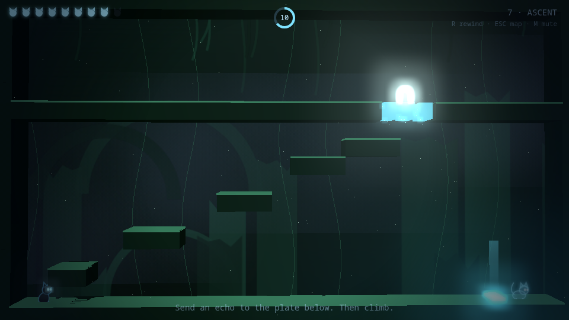
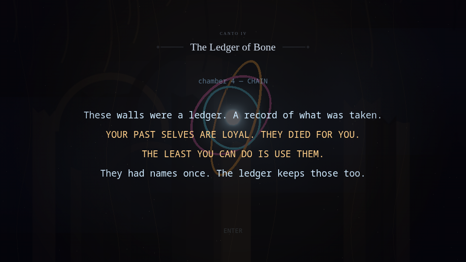
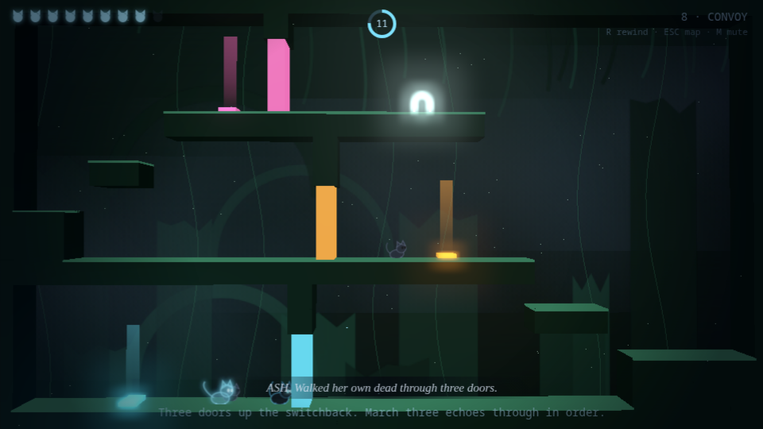
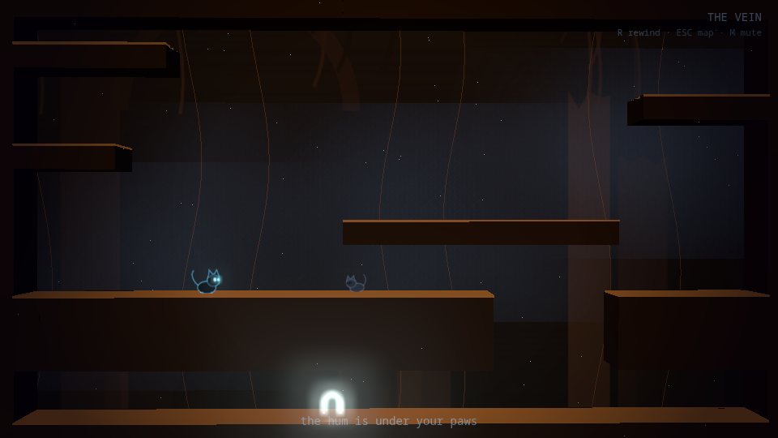
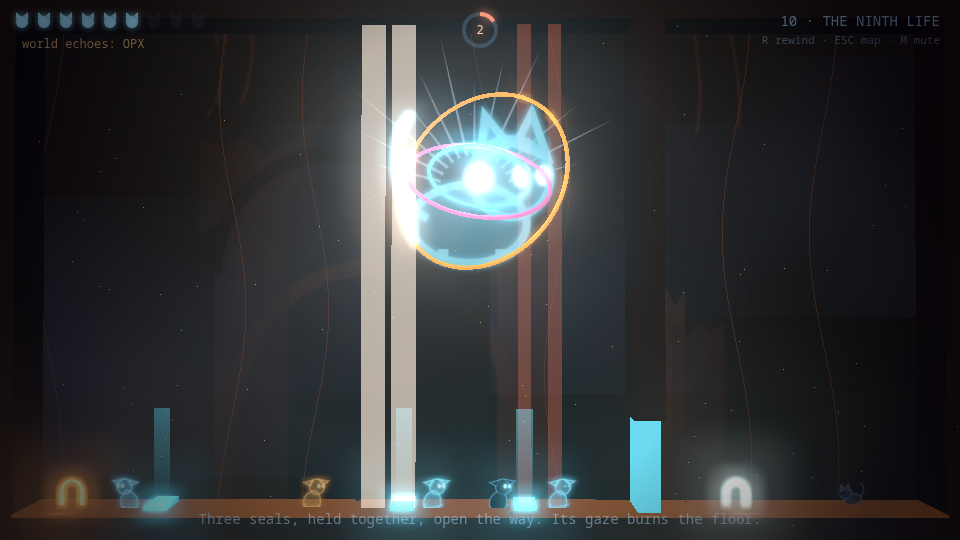

# THE NINTH ECHO

*A 15-second loop. Nine lives. One way out.*

**▶ Play it: https://game.opxz.dev**

Made in ~30 hours for **BTT Web Game Jam — Summer 2026**.


## The idea

You are a cat trapped in the Loom — a machine that broke time. Every chamber
runs on a **15-second loop**. When you press **R** (or time runs out, or you
die), the world rewinds — but **a life stays behind**: a ghost of you that
replays your last run, input for input.

Your past lives hold pressure plates, shove crates and stand in pits so the
current you can walk through doors they keep open. You have nine lives per
chamber. Spend them wisely.



## The fable

The story is one continuous folktale told in two voices. **THE LOOM** speaks in
gold uppercase and taunts you. A second, lowercase narrator tells the tale in
past tense — and deep down it turns out to be the First Cat itself, grieving
the machine the humans built to steal its gift. Every card is also **read
aloud**: the browser's own voice tells the tale, and drops half an octave
whenever the Loom speaks.

Under the Loom's tale hides a second, older one — **the First Telling**: a
cat, a door, a child, and Death coming up the lane on the sixth night,
counting. Eight **Night bells** are hidden across the descent; ring one and
one night of that first story is told — from the child's side or the
mother's, depending on a choice you walk through. The ninth night is the hole
in the narrator's memory. It can only be lived, at the bottom.

Every chamber opens on a canto card. Petrified cat husks are scattered
through the ruin; stand close and the dead speak their epitaph. Before the
finale a scripted **vigil** plays: every life you spent stands up out of the
floor and walks in beside you.



## The descent branches

The atlas is a forked cave survey now, not a line. Twice the Loom stops the
descent and **asks** — two doors, no menu, walking through commits:

- *Who was the story for?* — the child's road (a flooding tunnel) or the
  mother's road (a corridor of bells).
- *Give me your dead?* — the **tithe** (one chamber walked alone, rewind
  refused, the Loom holding your echoes) or the **long way** (five seals,
  one door, every life yours to spend and mourn).

Your answers change whose side of each Night you hear, how the vigil looks,
and which endings the heart will offer. Off the trunk hang secret side
chambers with their own tricks and their own bells.

## World echoes — you are never alone

When you clear a chamber, your winning runs upload (three arcade letters and
all). Other players then see your **golden echo cat** solving the room
alongside them, live, and race your time on the per-chamber leaderboard.
This works because the simulation is *deterministic*: an echo is just a byte
array of inputs replayed through identical physics — on anyone's machine.
Remote echoes run in a sandboxed shadow world, so they can never touch your
puzzle.

## Controls

| Key | Action |
|-----|--------|
| ← → / A D | move |
| ↑ / W / Space | jump |
| **R** | rewind the loop (spends a life, leaves an echo) |
| Esc / P | pause — then Q for the atlas |
| M | mute |

Desktop keyboard only — no touch controls.

## How it works

- **Deterministic fixed-timestep core** (60 Hz, vanilla JS): input recorded
  per tick as a bitmask; ghosts replay that byte array through the exact same
  tick order (boxes → ghosts oldest-first → player → plates/doors). No
  randomness, no wall-clock, no physics library in the simulation —
  determinism is the game.
- **three.js WebGL presentation**: bloom post-processing, dynamic point
  lights, depth-extruded chambers, particle systems, a camera that leans
  toward the cat. The render layer only *reads* sim state — it can never
  desync a replay.
- **The rewind is real**: every tick snapshots the world; the rewind cutscene
  plays your actual history backwards.
- **All audio synthesized** at runtime with WebAudio — the drone score, the
  tape-rewind sweep, the meow. Zero audio asset files. Every biome plays the
  same motif over the same chord shape, re-tuned underneath: root, interval
  colour, timbre, filter and pacing all darken on the way down, from a
  rain-blue triangle at the top to an ember sawtooth at the heart. Passages
  thin out to drones and air; the finale gets a tritone sitting in the sub.
- **The cat is code**: bezier tail, squash & stretch, blinking — drawn to a
  canvas texture billboarded into the WebGL scene. Left alone it sits down; it
  pins its ears flat when a warden's gaze is winding up.
- **Server**: Node/Express behind Caddy (auto-HTTPS) on our own Google Cloud
  VM, serving the game and the echo/leaderboard API at `game.opxz.dev`, with
  JSON-file persistence and an optional Firestore mirror.
- Every level is **machine-proven solvable**, and the proof ships: `bun run
  proof` runs a waypoint bot through the real physics, records its per-tick
  inputs, and replays them as ghosts through the same code path the game uses.
  29/29, non-zero exit if any chamber regresses — water, mirrors, bells,
  counting and both boss phases included, cleared *through* their schedules.
- Type-checked without a build step: `tsc --checkJs` over the plain JS
  (`bun run check`) — the browser runs exactly what's in this repo.

## The chambers

Twenty chambers across the branching descent, each teaching the loop a new
trick: holding, chaining, weighing, sacrificing, ascending, marching, a
paradox — and further down, water that rises on the loop's own schedule and
drowns a parked echo at the same tick every time, memory tiles that want your
footsteps back in order, bells that must ring low-far-high, a mirror room
where every spent life comes back x-reflected with left and right swapped,
and **Death's counting**: every hundred-and-twentieth tick, anything that
moves is counted. A frozen echo is safe forever — red-light-green-light with
your own dead. The Loom re-dresses itself as you descend — rain-blue
under-halls, a sepia bone archive, teal root-depths, the violet deep, and the
ember heart. Warden-watched chambers sweep fixed columns on a fixed schedule.


Four of those rooms were rebuilt from flat corridors into real vertical
space: ECHO's plate climbed three ledges up a wall, NINE became a stepped
descent with a claw shard hidden in a dead-end pocket, CHAIN split into two
storeys joined by a chimney, and CONVOY folded into a switchback — right along
the bottom, up, back left along the middle shelf, up again, a door gating each
leg.



Between the biomes sit three passages — THE DROP, THE SEAM, THE VEIN —
traversal-only shafts with no puzzle, no timer and no life count, so each
change of colour lands on a held breath.



Then the First Cat — a finale in **three phases**, fought entirely with the
loop itself. First the seals: three held at once, two directly under the
gaze, so the echoes you park there burn off unless you time the parking
against the sweep. Then the shuttle: the machine weaves faster, and Death's
counting joins the beams. And then — no fight at all. The beams stop. The
room is a child's room, and there is a door.



Five endings: **break** the Loom; **stay** in its warmth (and if you tithed
your dead away, learn what the machine really wanted from you); **sever** the
threads with the Claw assembled from three hidden shards; or — carrying all
eight Nights — stand at the ninth door and simply be still. The one verb the
game never asked of you. The ninth door opens both ways.

## Run it yourself

```
bun install
bun start          # http://localhost:8080 — works fully offline (in-memory board)
bun run proof      # the solvability proof: 29/29, exits non-zero on regression
bun run check      # tsc --checkJs, no build step
```

## Credits

Design, code, art, sound: opx0. All code and assets created during the jam
period.

License: MIT
